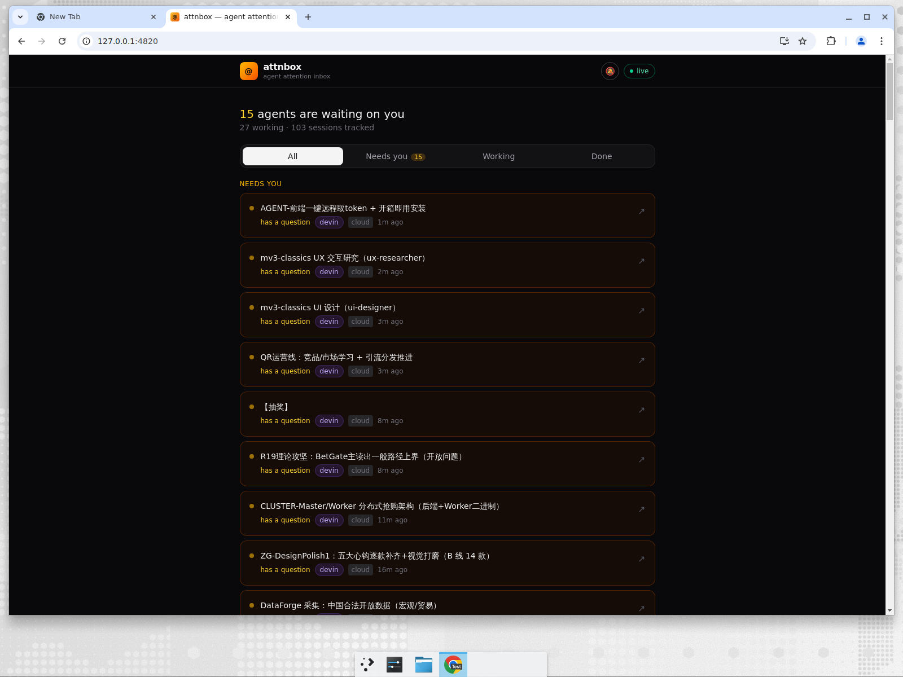

import { Card, CardGrid } from "@astrojs/starlight/components";

```bash
npx attnbox   # daemon + web inbox at http://127.0.0.1:4820
```

<CardGrid stagger>
  <Card title="Local + cloud, one view" icon="approve-check">
    Terminal agents (Claude Code, Codex CLI, Gemini CLI) and cloud agents
    (Devin, PRs awaiting your review) aggregate into one attention inbox.
    No tmux, no wrappers — local sessions are discovered by reading the
    logs the agents already write.
  </Card>
  <Card title="Mobile-first PWA" icon="phone">
    Install it on your phone's home screen. Live SSE updates, browser
    notifications the moment an agent starts waiting on you.
  </Card>
  <Card title="Privacy-first" icon="seti:lock">
    Everything stays on your machine: the daemon binds to 127.0.0.1 and
    cloud API keys are only ever sent to their own vendor.
  </Card>
  <Card title="Honest signals" icon="information">
    Every status is tagged <code>authoritative</code> or
    <code>heuristic</code>, and the per-source boundaries are documented —
    no pretending. Optional hooks upgrade Claude Code and Codex to
    authoritative.
  </Card>
</CardGrid>


